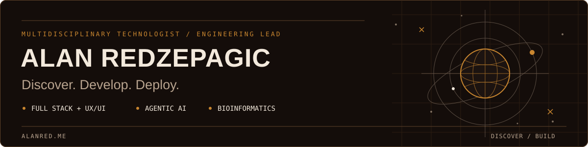

# Alan Redzepagic

**Multidisciplinary technologist & engineering lead.**

Full-stack engineering, UX/UI, agentic systems, and bioinformatics.

I connect technical direction with hands-on product development: shaping the experience, designing the architecture, and building the systems behind it. My work spans the interface people use, the data and intelligence underneath, and the infrastructure that keeps it running.

[Website](https://alanred.me) · [LinkedIn](https://www.linkedin.com/in/alanredzepagic) · [X / Twitter](https://x.com/allanred)

   

   

## Product engineering & UX/UI

I work across user flows, interface design, component systems, and full-stack implementation. API contracts and data models have to support the intended experience; accessibility, performance, and deployment are part of delivering the product.

## Cloud architecture

**AWS:** infrastructure as code with CDK; containerized services on ECS/Fargate; Lambda and Step Functions for event-driven workloads. CloudFront at the edge, Aurora and DynamoDB for application state, S3 for storage. Network boundaries, IAM, and observability are part of the architecture, not a later hardening pass.

**Vercel:** TypeScript, React, and Next.js applications with server-first rendering, deliberate caching, and preview deployments. I choose the runtime per workload, balancing delivery speed against operational control and long-term cost.

## DevOps & self-hosting

I own the path from a reviewed change to a running service: CI/CD, environment isolation, secrets management, database migrations, monitoring, and rollback. Infrastructure is versioned and reproducible; releases need a recovery path.

Self-hosting includes the operational work: Linux, containers, networking, updates, backups, and recovery. I use managed services where they reduce that burden, and self-host where the control is worth maintaining. Kubernetes has a place when the workload warrants its complexity.

## Agentic engineering & bioinformatics

I build agentic systems with durable workflows, retrieval, scoped tool access, and inspectable execution. AWS Bedrock, LangChain/LangGraph, and self-hosted inference serve different deployment requirements. Models should be replaceable; state, credentials, and action permissions should remain under our control.

In bioinformatics, I focus on genomic data workflows and interpretation interfaces, keeping deterministic analysis distinct from model-generated explanation. Provenance, uncertainty, and data privacy shape the engineering.

## Writing

- [AI sovereignty: when assistance becomes dependence](https://alanred.me/articles/ai-sovereignty-when-assistance-becomes-dependence) — Deployment control, replaceable models, and ownership of the agent harness.
- [Managing the whole forest](https://alanred.me/articles/managing-the-whole-forest) — Technical direction and verification across the whole product.

## Get in touch

For engineering leadership, product development, or applied AI: [LinkedIn](https://www.linkedin.com/in/alanredzepagic) · [X / Twitter](https://x.com/allanred)
